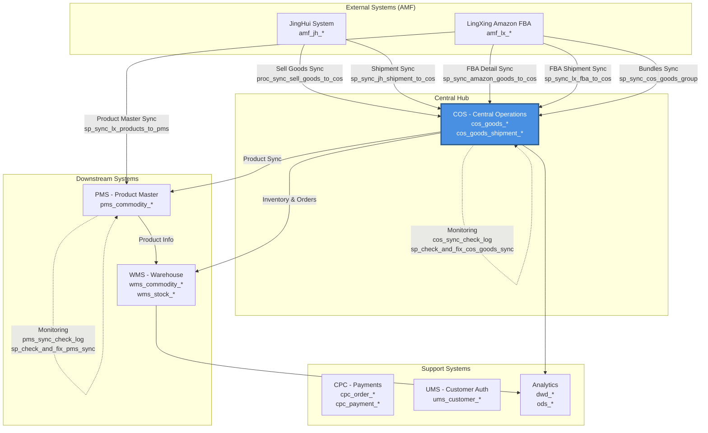
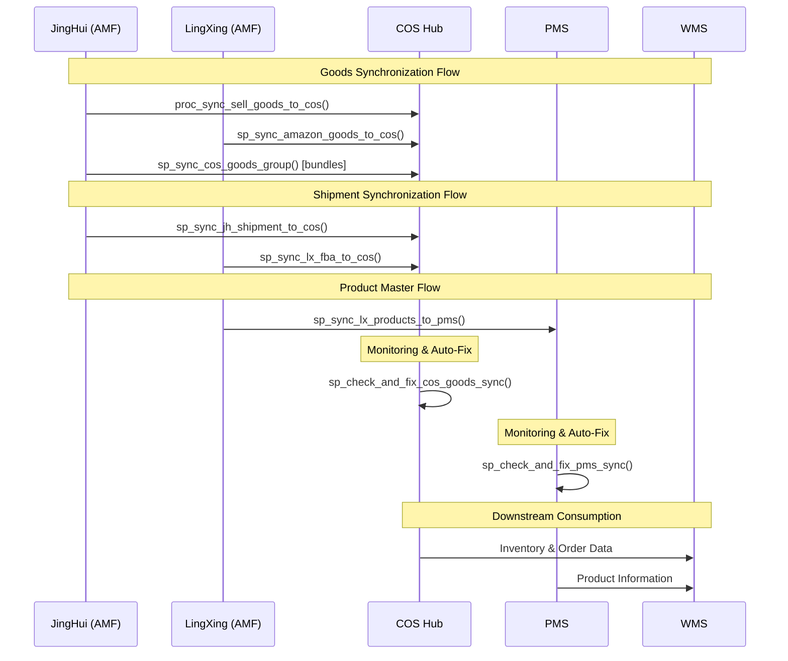

# Buyi Cloud Platform

A comprehensive e-commerce operations platform featuring data integration, warehouse management, and multi-channel order processing with COS (Central Operations System) as the central hub.

## Table of Contents
- [Overview](#overview)
- [Architecture](#architecture)
- [Business Modules](#business-modules)
- [Key Data Flows](#key-data-flows)
- [Database Schema](#database-schema)
- [Getting Started](#getting-started)

## Overview

Buyi Cloud Platform is a database-driven system that integrates multiple e-commerce channels (Amazon FBA, JingHui marketplace) with centralized operations, warehouse management, and analytics. The system uses MySQL stored procedures and ETL processes to synchronize product information, inventory, and shipments across different business modules.

**Core Design Principle**: COS (Central Operations System) serves as the central hub, aggregating goods and shipment data from various external sources (AMF integrations) and feeding downstream systems like PMS (Product Master System) and WMS (Warehouse Management System).

## Architecture

The platform follows a hub-and-spoke architecture with COS at the center:



## Business Modules

### 1. AMF (Amazon & Marketplace Federation)
**Tables**: `amf_jh_*`, `amf_lx_*`

Integration layer for external e-commerce systems:
- **JingHui (JH)**: Chinese marketplace integration
  - Sell goods management (`amf_jh_sell_goods`)
  - Shipment tracking (`amf_jh_shipment`)
  - Purchase orders and inventory (`amf_jh_purchase_goods`, `amf_jh_warehouse_stock`)
  - Company goods and bundles (`amf_jh_company_goods`, `amf_jh_comapny_goods_group`)
  
- **LingXing (LX)**: Amazon FBA operations
  - FBA inventory management (`amf_lx_fba_stockup`)
  - Amazon order processing (`amf_lx_amzorder`)
  - Bundled products (`amf_lx_bundledproducts`, `amf_lx_bundled_product_items`)

### 2. COS (Central Operations System) - The Hub
**Tables**: `cos_goods_*`, `cos_goods_shipment_*`, `cos_amf_*`, `cos_distribution_*`

The central hub that aggregates and normalizes data from all sources:

**Goods Management**:
- Unified product hierarchy: SPU → SKC → SKU
- Tables: `cos_goods_spu`, `cos_goods_skc`, `cos_goods_sku`
- Product attributes and BOM (`cos_goods_attribute`, `cos_goods_bom`)
- Product groups and bundles (`cos_goods_group`)
- Inventory tracking (`cos_goods_sku_stock`, `cos_goods_sku_intransit_stock`)
- Sales analytics (`cos_goods_sku_sale`, `cos_goods_sku_daily_sale`)

**Shipment Management**:
- Unified shipment tracking: `cos_goods_shipment`, `cos_goods_shipment_item`
- FBA stock management: `cos_fba_stock`, `cos_fba_stock_regroup`

**Multi-channel Integration**:
- Shop-specific data: `cos_goods_shop`
- Platform-specific tables: `cos_shein_*`, `cos_temu_*`, `cos_tiktok_*`, `cos_jst_*`

### 3. PMS (Product Master System)
**Tables**: `pms_commodity_*`

Product master data management:
- Product hierarchy: `pms_commodity` (SPU), `pms_commodity_skc`, `pms_commodity_sku`
- Product specifications and attributes (`pms_commodity_spec`, `pms_commodity_attribute`)
- Pricing and inventory (`pms_commodity_base_price`, `pms_commodity_adjust_stock_log`)
- Product relationships and categories (`pms_commodity_relation`, `pms_category_mapping_relation`)
- Rich content management (`pms_commodity_rich_text`, `pms_commodity_skc_attachment`)

### 4. WMS (Warehouse Management System)
**Tables**: `wms_commodity_*`, `wms_sku_*`, `wms_warehouse_*`, `wms_stock_*`

Warehouse operations and inventory management:
- Multi-dimensional inventory tracking (by shop, warehouse, SKU level)
- Tables: `wms_commodity_sku_stock`, `wms_commodity_sku_shop_stock`
- Stock operations: `wms_input_record`, `wms_output_record`, `wms_inventory_transfer`
- Purchase and replenishment: `wms_purchase_*`
- Delivery orders: `wms_delivery_order`
- Occupied stock tracking: `wms_commodity_sku_occupied_stock`

### 5. OMS (Order Management System)
**Tables**: `oms_order_*`, `oms_pay_*`, `oms_refund_*`

Order processing and fulfillment:
- Order lifecycle management
- Payment processing
- Refunds and returns
- Settlement tracking: `oms_settle_*`

### 6. CPC (Customer Payment Center)
**Tables**: `cpc_order_*`, `cpc_payment_*`, `cpc_account_*`, `cpc_refund_*`, `cpc_settlement_*`

Payment processing and reconciliation:
- Payment gateway integration
- Account management and transfers (`cpc_account`, `cpc_account_change`, `cpc_transfer_*`)
- Reconciliation: `cpc_excel_reconciliation`
- Payer/payee management (`cpc_payer_info`, `cpc_payee_info`)
- Bank integration: `cpc_bank_code`

### 7. UMS (User Management System)
**Tables**: `ums_customer_*`

Customer and authentication management:
- Customer profiles: `ums_customer`
- Customer companies and contracts (`ums_customer_company`, `ums_customer_contract`)
- Address management: `ums_customer_receive_address`
- Customer collections and tags (`ums_customer_collect`, `ums_customer_collect_tag`)

### 8. Analytics & Data Warehouse
**Tables**: `dwd_*`, `ods_*`

Data warehouse layers for reporting and analytics:
- **DWD (Data Warehouse Detail)**: Detailed fact tables
  - Sales analysis: `dwd_prd_sales_detail_info`, `dwd_si_sell_detail_info`
  - Stock information: `dwd_prd_stock_info`
  - Platform-specific analytics: `dwd_tiktok_*`, `dwd_temu_*`
  
- **ODS (Operational Data Store)**: Staging layer
  - TikTok product dimensions: `ods_tiktok_*`

### 9. System Configuration
**Tables**: `sys_*`

System-wide configuration and management:
- Company and organizational structure: `sys_company_*`
- User and role management: `sys_user_*`, `sys_role_*`
- Data dictionaries and categories: `sys_dict_*`, `sys_category_*`
- File and attachment management: `sys_file_*`, `sys_attachment_*`

## Key Data Flows

### Flow 1: AMF → COS (Goods Synchronization)

Data flows from external systems into the COS hub for unified goods management:

**JingHui Sell Goods → COS Goods**
- **Procedure**: `proc_sync_sell_goods_to_cos()`
- **Source**: `amf_jh_sell_goods`
- **Target**: `cos_goods_spu`, `cos_goods_skc`, `cos_goods_sku`
- **Purpose**: Synchronize JingHui marketplace products into centralized goods catalog

**LingXing FBA Detail → COS Goods**
- **Procedure**: `sp_sync_amazon_goods_to_cos(p_company_id, p_days)`
- **Source**: `amf_lx_fba_*` tables
- **Target**: `cos_goods_*` hierarchy
- **Purpose**: Import Amazon FBA product details into COS for unified inventory management

**Bundles → COS Goods Group**
- **Procedure**: `sp_sync_cos_goods_group()`
- **Source**: `amf_jh_comapny_goods_group`, `amf_lx_bundledproducts`
- **Target**: `cos_goods_group`
- **Purpose**: Synchronize product bundles and kits from external systems

**Monitoring & Auto-Fix**:
- **Log Table**: `cos_sync_check_log`
- **Auto-Fix Procedure**: `sp_check_and_fix_cos_goods_sync()`
- **Purpose**: Monitor sync health and automatically correct data inconsistencies

### Flow 2: AMF → COS (Shipments Synchronization)

Shipment data flows into COS for unified tracking:

**JingHui Shipments → COS Shipments**
- **Procedure**: `sp_sync_jh_shipment_to_cos(p_company_id, p_days)`
- **Source**: `amf_jh_shipment`, `amf_jh_shipment_sku`
- **Target**: `cos_goods_shipment`, `cos_goods_shipment_item`
- **Purpose**: Track JingHui shipments in centralized system

**LingXing FBA Shipments → COS Shipments**
- **Procedure**: `sp_sync_lx_fba_to_cos(p_company_id, p_days)`
- **Source**: `amf_lx_fba_stockup`
- **Target**: `cos_goods_shipment`, `cos_fba_stock`
- **Purpose**: Import Amazon FBA inbound shipments for inventory planning

**Note**: OWMS (Other Warehouse Management System) shipment sync is also available but has lower impact on core operations.

### Flow 3: AMF/LX → PMS (Product Master Sync)

Product master data synchronization:

**LingXing Products → PMS**
- **Procedure**: `sp_sync_lx_products_to_pms()`
- **Source**: `amf_lx_*` product tables
- **Target**: `pms_commodity_*` hierarchy
- **Purpose**: Maintain authoritative product master data for the entire platform

**Monitoring & Auto-Fix**:
- **Log Table**: `pms_sync_check_log`
- **Auto-Fix Procedure**: `sp_check_and_fix_pms_sync()`
- **Purpose**: Ensure PMS data integrity and automatic correction of sync issues

### Data Flow Summary



## Database Schema

The database schema is provided in SQL dump files:

- **`buyi_platform_dev.sql`**: Complete platform schema (432+ tables)
  - Contains all module definitions (AMF, COS, PMS, WMS, OMS, CPC, UMS, analytics)
  - Includes table structures, indexes, and constraints
  - Note: Stored procedures may be included inline or in separate files

### Schema Organization

Tables are organized by prefix:
- `amf_jh_*` - JingHui marketplace integration (23 tables)
- `amf_lx_*` - LingXing Amazon FBA integration (22 tables)
- `cos_goods_*` - Central goods management (25 tables)
- `cos_*` - Other COS modules (shipments, distribution, platform-specific)
- `pms_commodity_*` - Product master system (23 tables)
- `wms_*` - Warehouse management (30+ tables)
- `oms_*` - Order management (30+ tables)
- `cpc_*` - Payment and reconciliation (20+ tables)
- `ums_customer_*` - Customer management (7 tables)
- `dwd_*`, `ods_*` - Analytics and data warehouse (12 tables)
- `sys_*` - System configuration and management (28+ tables)

## Getting Started

### Prerequisites
- MySQL 8.0.36 or higher
- Database client (MySQL Workbench, DBeaver, or command-line client)

### Installation

1. **Clone the repository**:
   ```bash
   git clone https://github.com/yy945nb/buyi_cloud.git
   cd buyi_cloud
   ```

2. **Create database**:
   ```sql
   CREATE DATABASE buyi_platform_dev CHARACTER SET utf8mb4 COLLATE utf8mb4_0900_ai_ci;
   ```

3. **Import schema**:
   ```bash
   mysql -u your_username -p buyi_platform_dev < buyi_platform_dev.sql
   ```

4. **Verify installation**:
   ```sql
   USE buyi_platform_dev;
   SHOW TABLES;
   -- Should show 432+ tables
   ```

### Running ETL Processes

The system uses stored procedures for data synchronization. Example usage:

```sql
-- Sync JingHui goods to COS (if procedure exists)
CALL proc_sync_sell_goods_to_cos();

-- Sync Amazon FBA goods for company 1, last 7 days (if procedure exists)
CALL sp_sync_amazon_goods_to_cos(1, 7);

-- Sync LingXing products to PMS (if procedure exists)
CALL sp_sync_lx_products_to_pms();

-- Check and fix COS goods sync (if procedure exists)
CALL sp_check_and_fix_cos_goods_sync();
```

**Note**: Stored procedure definitions may be included in the SQL dump or managed separately. Refer to your deployment documentation for specific procedures available in your environment.

### Monitoring

Check synchronization logs:
```sql
-- Check COS sync status (if table exists)
SELECT * FROM cos_sync_check_log ORDER BY create_time DESC LIMIT 10;

-- Check PMS sync status (if table exists)
SELECT * FROM pms_sync_check_log ORDER BY create_time DESC LIMIT 10;
```

## Contributing

This repository contains database schema and ETL logic for the Buyi Cloud Platform. When making changes:
1. Test schema changes in a development environment first
2. Document any new tables or procedures
3. Update this README if adding new modules or data flows
4. Ensure backward compatibility with existing data

## License

[Specify your license here]

## Support

For questions or issues, please contact the development team or open an issue in this repository.